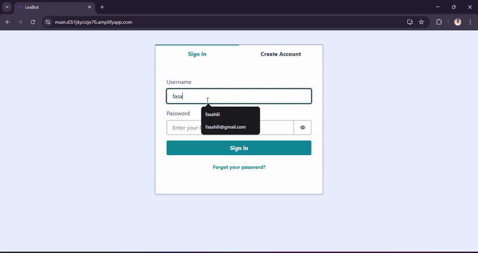

# 🤖 LexiBot 

Lex Amplify Assistant is a **serverless AI assistant** that integrates **Amazon Lex V2**, **Lambda**, **Cognito**, and **DynamoDB**, built on a **React** frontend using **AWS Amplify**. The bot allows users to sign in, execute AWS operations (like managing EC2, VPCs, and S3), and view/delete their chat history.

---

## 🎬 Demo



---
## 📐 Architecture Overview

```plaintext
                  ┌──────────────────┐
     Chat Input → │   React Frontend │
                  └────────┬─────────┘
                           ↓
                ┌────────────────────┐
                │   Amazon Lex V2    │
                └──────┬──────┬──────┘
                       ↓      ↓
         ┌──────────────┐   ┌───────────────────────┐
         │ AWS Lambda    │   │  Cognito Authentication│
         └────┬──────────┘   └───────────────────────┘
              ↓
      ┌──────────────┐
      │ Amazon EC2   │
      │ Amazon VPC   │ ← AWS Fulfillment
      │ Amazon S3    │
      └──────┬───────┘
             ↓
      ┌──────────────┐
      │ DynamoDB     │ ← Message logs (per user)
      └──────────────┘
````

---

## ⚙️ Features

| Feature            | Description                                     |
| ------------------ | ----------------------------------------------- |
| 🛡 Auth            | Cognito User Pools (Sign up, Sign in, Sign out) |
| 🤖 AI Bot          | Lex V2 integration with multiple intents        |
| 🧠 Fulfillment     | Unified Lambda function for all AWS tasks       |
| 💬 Chat UI         | Responsive UI with typing indicator             |
| 📚 Chat History    | Per-user message logs with delete option        |
| 🧾 Sample Commands | Sidebar with guided examples                    |
| 🚀 Hosting & CI/CD | Amplify GitHub integration                      |

---

## 🧰 Technologies

* **Frontend**: React, Amplify UI
* **Bot**: Amazon Lex V2
* **Backend**: AWS Lambda, DynamoDB
* **Authentication**: Amazon Cognito
* **Hosting**: AWS Amplify (CI/CD from GitHub)
* **Styling**: CSS Modules
* **UX Tools**: SweetAlert2, Typing animation

---

## 📦 Setup Guide

### 1. Clone Project

```bash
git clone https://github.com/YOUR_USERNAME/lex-amplify-assistant.git
cd frontend
npm install
```

---

### 2. Initialize Amplify

```bash
amplify configure
amplify init
```

---

### 3. Add Required Services

```bash
amplify add auth        # Cognito User Pool
amplify add hosting     # Amplify Hosting
amplify push            # Deploy backend config
```

> ✅ Make sure the `amplifyconfiguration.json` and `aws-exports.js` are generated and imported.

---

### 4. Setup Lex and Lambda Fulfillment

* Go to **Amazon Lex V2 Console**
* Create a bot with the following **intents**:

  * `ListEC2InstancesIntent`
  * `StartEC2InstanceIntent`
  * `StopEC2InstanceIntent`
  * `DescribeVPCsIntent`
  * `ListS3BucketsIntent`
* Create a single **Lambda function** to handle all intents and return responses.
* Add the function’s ARN as the fulfillment Lambda to each intent.
* Give **`amplify-<env>-authRole`** permission for:

  * `lex:RecognizeText`
  * `dynamodb:*`
  * `ec2:*`
  * `s3:*`

---

## ✏️ Lex Sample Utterances

```txt
Intent: ListEC2InstancesIntent
- list my ec2 instances
- show my instances
- display all ec2

Intent: StartEC2InstanceIntent
- start instance i-0123456789abcdef
- please start EC2 i-0123456789abcdef

Intent: StopEC2InstanceIntent
- stop instance i-0123456789abcdef
- shutdown i-0123456789abcdef

Intent: DescribeVPCsIntent
- describe vpcs
- show my virtual private clouds

Intent: ListS3BucketsIntent
- list my buckets
- show s3 buckets
- get all s3 storage
```
---

## 🛠 Project Structure

```

frontend/
├── components/         # React Components (Chat, History, Menu)
├── style/              # Component CSS files
├── App.jsx             # Root layout with Auth and Navigation
├── amplify/            # Amplify config
├── aws-exports.js      # Auto-generated Amplify config
└── index.js            # Entry point

````

---

## 🎬 Demo


---

## 🚀 Deploy to Amplify Hosting

1. Push to GitHub
2. Go to [AWS Amplify Console](https://console.aws.amazon.com/amplify/)
3. Connect repository and branch
4. Use the following build settings:

```yaml
version: 1
frontend:
  phases:
    build:
      commands:
        - npm ci
        - npm run build
  artifacts:
    baseDirectory: build
    files:
      - '**/*'
  cache:
    paths:
      - node_modules/**/*
```

---

## 🔐 IAM Notes

> To avoid `AccessDeniedException` for Lex, make sure your `amplify-frontend-authRole` includes:

```json
{
  "Effect": "Allow",
  "Action": [
    "lex:RecognizeText"
  ],
  "Resource": "*"
}
```

---

## ❌ Common Issues

| Issue                             | Fix                                                       |
| --------------------------------- | --------------------------------------------------------- |
| `User pool client does not exist` | Re-run `amplify pull` or recreate user pool               |
| `CORS error from Lambda URL`      | Add CORS headers in Lambda: `Access-Control-Allow-Origin` |
| `403 Forbidden from Lex`          | Add `lex:RecognizeText` to auth role                      |

---

## 🧠 Future Enhancements

* Multi-region bot support
* Chat context awareness (sessions)
* Support for more AWS services
* Admin dashboard

---
